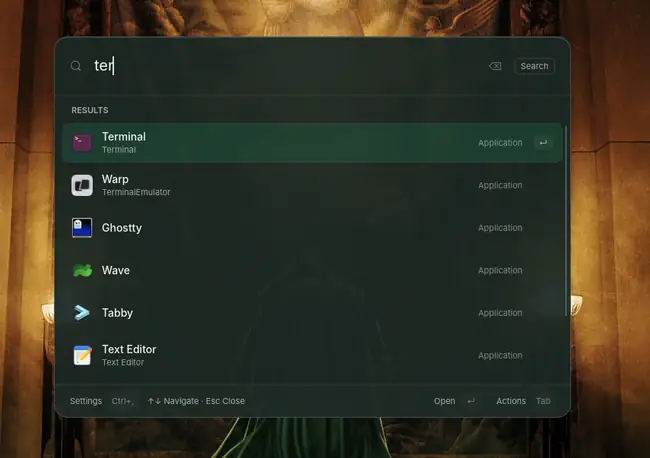
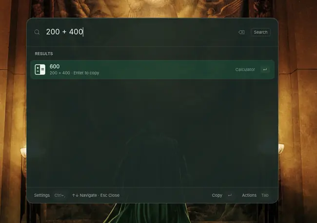
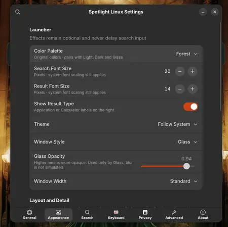

# Spotlight Linux

A fast Spotlight-style launcher for Linux, built with Rust, GTK 4, and libadwaita.


## Features

- Fast application search and launch
- Built-in calculator
- Keyboard-first navigation
- Customizable appearance, sizing, and shortcuts
- Optional launch at login
- Native GTK 4 / libadwaita interface

## Screenshots

<p align="center">
  
  
</p>

<p align="center">
  
</p>

## Install

### Ubuntu / Debian

```bash
git clone https://github.com/SHADOWOKX/Spotlight-linux.git
cd Spotlight-linux

./scripts/bootstrap-ubuntu.sh
./scripts/install-user.sh
```

After installation, open **Spotlight Linux** from GNOME Overview. The default shortcut is **Alt+Space** if available.

## Uninstall

```bash
./scripts/uninstall-user.sh
```

## Build from source

```bash
cargo build --locked --release -p spotlight-gtk
```

## License

See [LICENSE](LICENSE).
